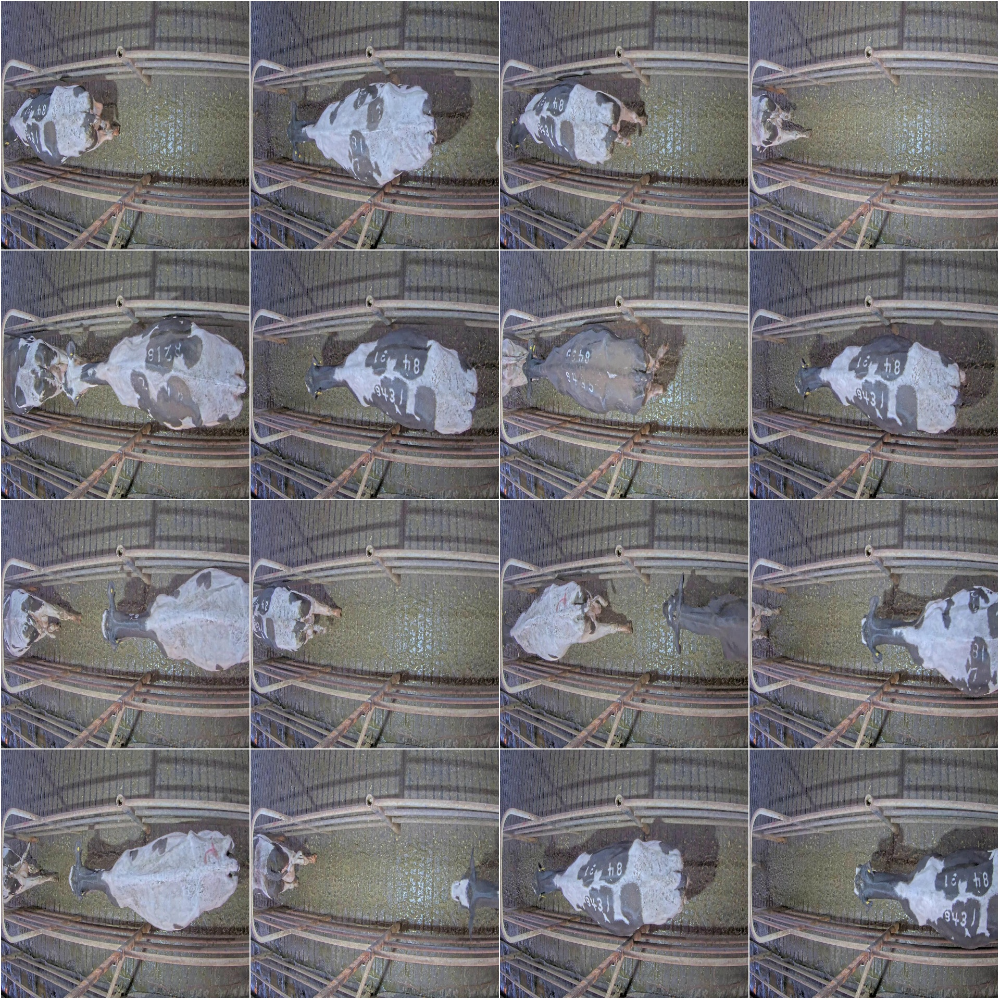
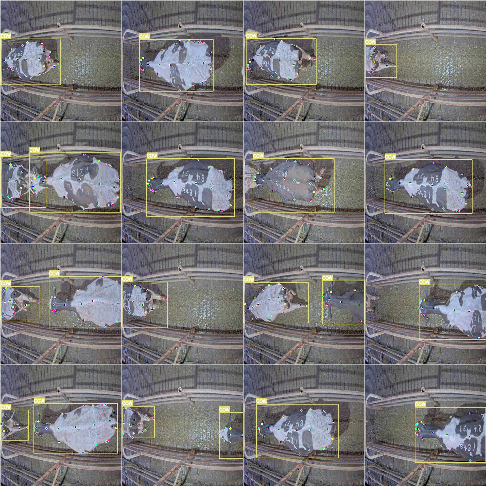

# Cow Keypoint Pose Estimation Detection Dataset COCO+YOLO Format with 923 Images in 1 Category and 25 Keypoints

Dataset Format: YOLO Keypoint Format (Note that this is not the format for object detection or segmentation of YOLO, but only includes JPG images and corresponding YOLO format TXT files)
Number of Images (number of JPG files): 923
Number of Annotations (number of TXT files): 923
Training Set Size: 823
Validation Set Size: 100
Test Set Size: 0
Number of Annotation Categories: 1
Annotation Category Name: ['COW']
Number of Keypoints to be Annotationated: 25
Keypoint Names: ["head", "nose", "eyeL", "eyeR", "earbaseL", "earbaseR", "neck", "withers", "midBack", "midHooks", "elbowFL", "elbowFR", "ribL", "ribR", "hookL", "hookR", "elbowBL", "kneeBL", "pawBL",
 "elbowBR", "kneeBR", "pawBR", "pinL", "pinR", "tailbase"]
Number of Boxes per Annotation:
- COW Boxes = 1585
Total Boxes = 1585
Image Resolution: 1920x1080
Important Note: The dataset has been split into training, validation, and test sets, which can be directly used for training Yolov5-pose, Yolov8-pose, Yolov11-pose, or Yolov26-pose.
Special Remark: This dataset does not guarantee the accuracy of the trained models or weight files.
Image Preview:
Example of Annotation:
Original Image (randomly select 16 images):
Annotation drawing result:

## Images

Here is a pay link on Stripe ( https://buy.stripe.com/3cs8yP7sY87d0vu9AB ). Please contact me lonlonago@foxmail.com after funding $89, and I will send you a complete data files , thank you!

